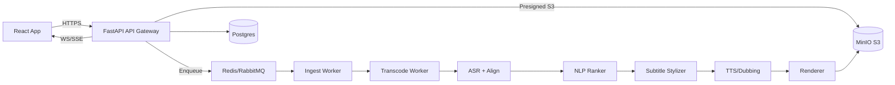

# 00 — Overview

**Goal:** A SaaS that turns long videos (upload or YouTube) into **viral clips** (auto-detected highlights), with **animated subtitles**, **multi-language voice-over**, and a **Movie Retell** mode that condenses a 2h film into <1h coherent narrative video.

**Principles**
- **OSS-first**, GPUs when available, CPU fallback for small loads.
- **Scalable pipeline** with idempotent jobs and strong observability.
- **Elegant UI** with 3D animations (React Three Fiber), fast and accessible.
- **Multi-tenant** SaaS: orgs/teams, metering, billing, quotas, roles.

**High-level Architecture**

