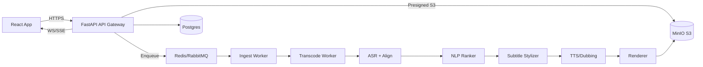

# 00 — Overview

**Goal:** A SaaS that turns long videos (upload or YouTube) into **viral clips** (auto-detected highlights), with **animated subtitles**, **multi-language voice-over**, and a **Movie Retell** mode that condenses a 2h film into <1h coherent narrative video.

**Principles**
- **OSS-first**, GPUs when available, CPU fallback for small loads.
- **Scalable pipeline** with idempotent jobs and strong observability.
- **Elegant UI** with 3D animations (React Three Fiber), fast and accessible.
- **Multi-tenant** SaaS: orgs/teams, metering, billing, quotas, roles.

**High-level Architecture**

**Current Implementation Snapshot**
- FastAPI routes cover the full SaaS surface area and now persist identity, pipeline, compliance, and billing data to Postgres while surfacing presigned MinIO upload URLs for direct video ingest.
- Celery-backed ingest, transcode, ASR, clip discovery, subtitle styling, TTS, retell, and export workers execute the full media pipeline—pulling sources, registering artifacts in MinIO, and updating job status through authenticated callbacks.
- The React 18 + Tailwind dashboard authenticates against the API, lets teams create organizations/projects, queue uploads or YouTube ingest, edit transcripts and clips inline, preview generated media, and monitor quotas with real-time job updates.
- Clip scoring now fuses motion changes, audio dynamics, transcript keywords, and pacing targets with stored confidence breakdowns, subtitles honour environment-driven brand presets, and dubbing blends synthesized narration with calibrated loudness while workers log usage metrics back to billing automatically.
- Final exports append configurable intro/outro slates, watermark the master render using organisation branding, and expose all weighting, preset, and loudness heuristics via environment variables for predictable QA.
- Brand kits persist to Postgres with API CRUD routes, workers consume overrides, and the dashboard includes a management surface plus project-level selectors so exports inherit the correct presets.
- Brand libraries now support MinIO-presigned uploads for watermark/logo/font/intro/outro assets with dashboard previews and deletion, so creative teams can manage all brand collateral without leaving the app.
- The clip editor adds waveform timelines with selectable transcript segments, split/merge tooling, and one-click alignment of clip bounds to transcript context for precise trims.
- QA regression runs capture locale/genre coverage, frame-diff expectations, overlay metadata, and post findings/reviews (with assignment context) to the API; the dashboard surfaces pass-rate metrics, coverage breakdowns, reviewer notes, approvals, overlay previews, and reference artifacts for each failing case.
- Prometheus/Otel instrumentation combined with Kubernetes manifests provides end-to-end observability out of the box.
- GitHub Actions CI builds API/workers/UI, runs the QA baseline, executes an API smoke test, and the new Kubernetes manifests cover Postgres, Redis, MinIO, API deployments, Celery workers, and OTLP collectors for production rollout.
