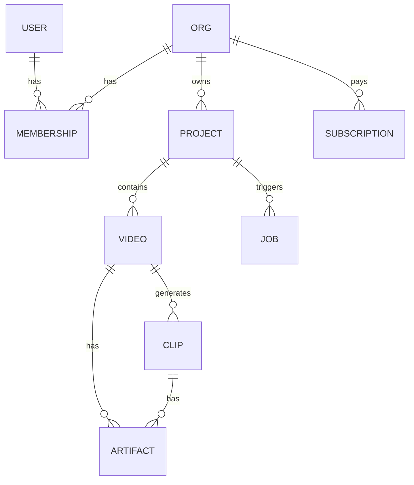

# 31 — Data Model

```mermaid
erDiagram
  USER ||--o{ MEMBERSHIP : has
  ORG ||--o{ MEMBERSHIP : has
  ORG ||--o{ PROJECT : owns
  PROJECT ||--o{ VIDEO : contains
  VIDEO ||--o{ CLIP : generates
  VIDEO ||--o{ ARTIFACT : has
  CLIP ||--o{ ARTIFACT : has
  PROJECT ||--o{ JOB : triggers
  ORG ||--o{ SUBSCRIPTION : pays
```
